# IT'S NOT JUST IN YOUR HEAD

I am an audio editor and social media manager for a weekly [podcast](https://podcasts.apple.com/us/podcast/its-not-just-in-your-head/id1508932075) by two therapists (+ guests) about Mental Health and Capitalism. The podcast aims to raise awareness that mental health issues aren’t just a problem of the individual but symptomatic of systemic problems.

As one has no real choice but to live in (or under) Capitalism, the podcast also needs money to operate - lol - and whilst we have a [Patreon](https://www.patreon.com/itsnotjustinyourhead) page and visibility on all the major podcast platforms, this new website will function as another point of entry for potential supporters.
 
 
 

# PRODUCT SHOT
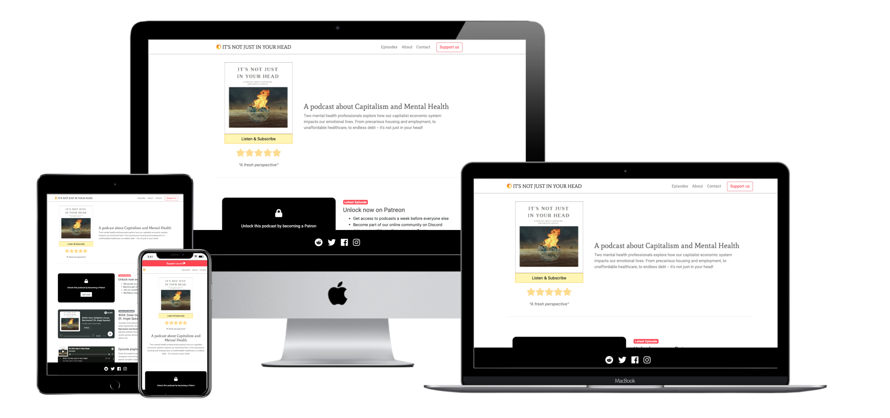
 
 
 

# UX

## User Stories

First Time Visitor Goals

>I want to quickly understand the sites purpose and to listen/subscribe.

>I want to navigate the site, effortlessly, to find content.

>I want to be assured that this is a trustworthy operation, I want access to others opinions/reviews and the social media feeds to see what others are saying.

 

Returning Visitor Goals

>I've decided I want to support the podcast, so want that to be obvious how I do that.

>I want a quick way to get in contact with the hosts.

>I want to find social media links.

 

Frequent User Goals

>I want to search different topics/episodes I might not have listened to.

>I want to stay up-to-date about the podcast, website etc.

 
 

## Design
 

Colour Scheme

* Taking a cue from the standard [Apple Podcasts page](https://podcasts.apple.com/us/podcast/its-not-just-in-your-head/id1508932075), I used a white background and grey/dark text with a generous use of negative space.

* I used a custom red, a hex value I took from the [Patreon branding page](https://www.patreon.com/brand), to glue the 'call-to-action' buttons to the brand. 

* I have taken inspiration from the flame on the [podcast poster image](assets/images/podcast-cover.jpg) and used a yellow/orange colour on a few instances:
    - The logo/icon in the top left
    - On 'hover' events when using the navigation bar
    - The listen/subscribe button
    - The five star rating

* Hopefully this yellow/orange colour creates a sense of 'brand' identity and continuity across the interaction. That the five star rating shares a similar colour may also have the subtle effect of aligning the concept of quality with the 'brand'.

 

Typography
* The 'Mate SC' font was used to replicate the poster image font in the navigation bar and 'Mate' was used on the hero image heading and on the hosts names.

* The main font is 'Roboto' ('if it ain't broke' etc) with Sans Serif as the fallback.

 

Logo/Icon
* In the wireframes I used a flame icon but once I applied colour it ended up looking like the Tinder logo! So the nav icon is the computer symbol for 'adjust' or contrast, meaningful! Also the circular nature ties into the globe on the poster image.

 

Wireframes
* Desktop - [Home](assets/images/readme_images/wf_desktop1.png), [Episodes](assets/images/readme_images/wf_desktop2.png), [About](assets/images/readme_images/wf_desktop3.png), [Contact](assets/images/readme_images/wf_desktop4.png)
* Mobile - [Home](assets/images/readme_images/wf_mobile1.png), [Episodes](assets/images/readme_images/wf_mobile2.png), [About](assets/images/readme_images/wf_mobile3.png), [Contact](assets/images/readme_images/wf_mobile4.png)

 
 
 

# LIBRARIES, FRAMEWORKS & PROGRAMS USED

1. Bootstrap 4.5:
    * Bootstrap was used throughout for layout, buttons etc.
    
2. Hover.css:
    * Hover.css was used for the benefit of desktop users: a nice underline on mouse hover!
    
3. Google Fonts:
    * Google fonts was used for 'Mate SC', 'Mate' and 'Roboto' fonts throughout the website.
    
4. Font Awesome:
    * Font Awesome was for the top navigation icon and the social media links.
    
5. jQuery:
    * jQuery was used for the Modal window.
    
6. Gitpod
    * Gitpod was used for all code creation and pushing to GitHub.
    
7. GitHub:
    * GitHub was used to store the projects code after being pushed from Gitpod.
    
8. Photoshop:
    * Photoshop was used to crop, resize and export the 'about' photos for the website.
    
9. Balsamiq:
    * Balsamiq was used to create the wireframes during the design process.

10. Spotify:
    * Spotify was used for embedding episodes and a playlist into the site.
    
11. [Web Formater](https://webformatter.com/):
    * To format my html and css code

 
 
 

# FEATURES

## Navigation

The site is a single page design and the nav links (including the icon/title) are anchors points. All external links throughout the site open in a seperate window/tab.

Desktop:
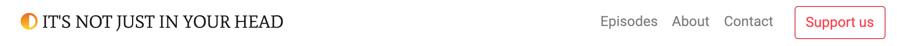
The desktop navigation bar sticks to the top of the page throughout the users experience, this is particularly important as at any point they can push the call-to-action button, Support Us.

Mobile:
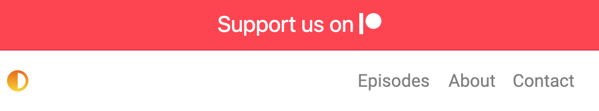
I didn't want the navigation to be hidden inside a 'burger' menu so choose to lose the 'title' and 'support us' button (and opt for a top banner instead) leaving space for the navigation names to be displayed.
 
 

## Landing page

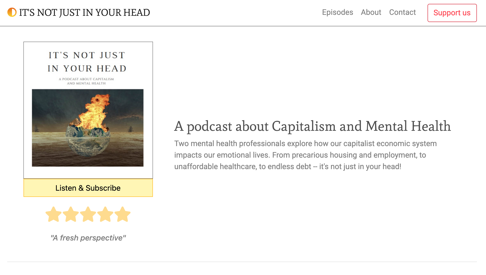
Quite quickly you get a summary of what the podcast is about, a testimonial, a way to listen/subscribe and the option to support the podcast.

- Listen & Subscribe:
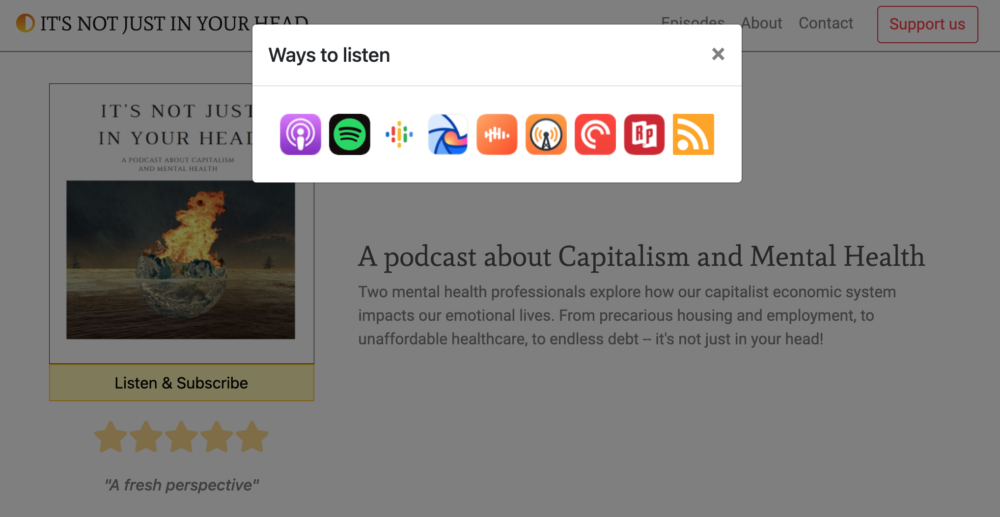
The button opens a Modal with podcast platform options, this keeps the main landing page clean and minimal. 
 
 

## Episodes

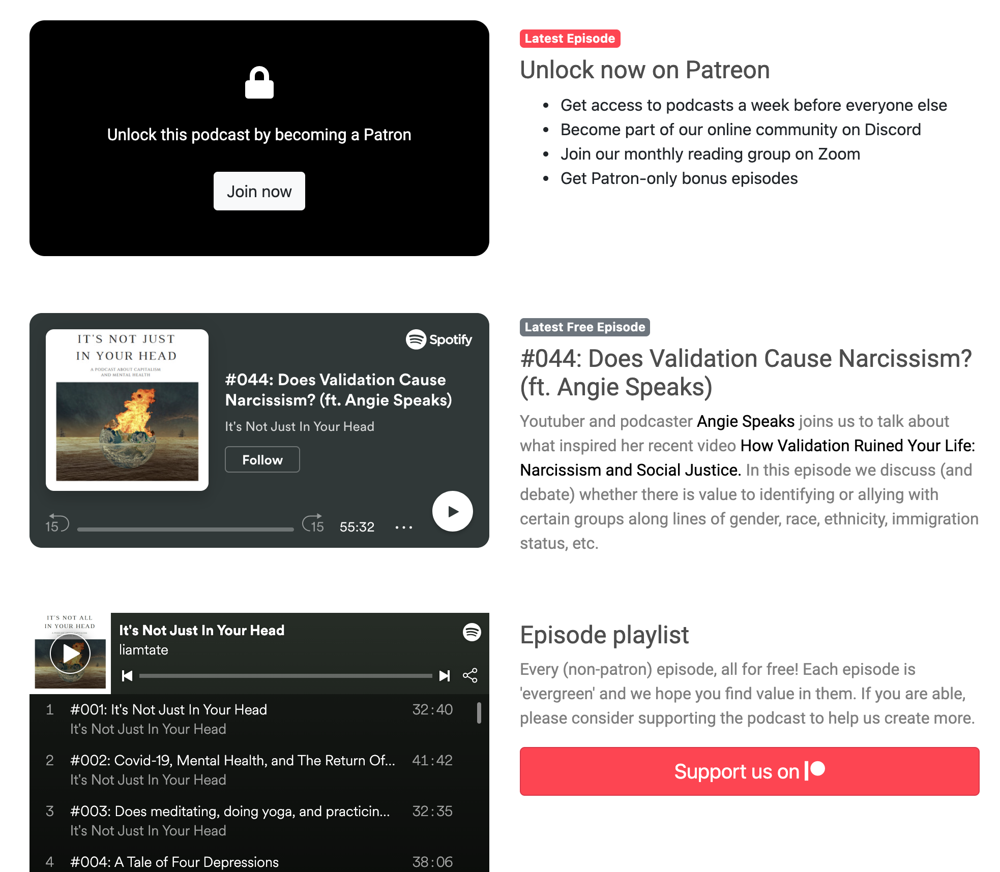
There are a few design decision going on here, so i'll go through them one by one:
 
 

- **Patreon**
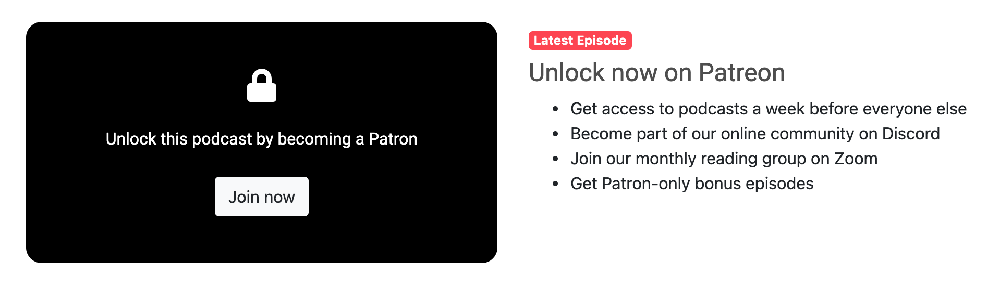
- The black box at the top is my attempt to recreate what one sees when browsing any given Patreon page, [locked content!](assets/images/readme_images/original_patreon_locked.png)

- I've used a red small badge, using the Patreon brand colour, and listed various perks as a preview for what a user might read on the Patreon page. 

- Given that there are already quite a few instances of the support button on the page, I decided not to put one below the bullet points and saved it to act as a book-end to the episode section. 
 
 

- **Free episode**
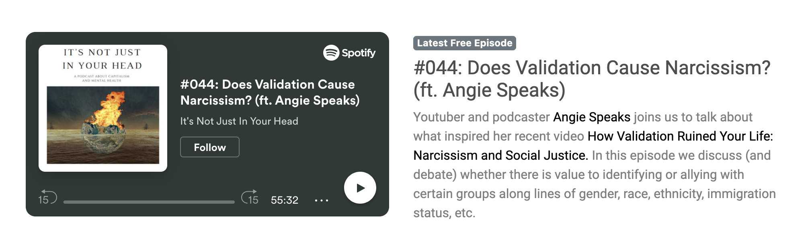
- This follows the same design format but whilst the locked content has a small red badge, this has a monochromatic badge informing the user that it's free. Hyperlinks have been differentiated from the main text with a black colour.
 
 

- **Free playlist**
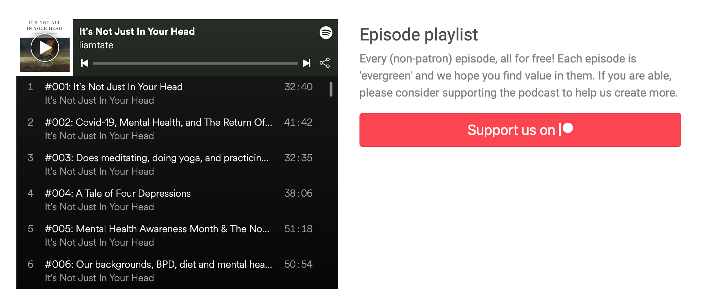
- Placing the support button alongside the full list of free episodes is an attempt at reciprocity: 'here, have all this free content, it would be great if you could give something back in return' etc.
- For continuity I would liked to have made the playlists border edges curved, whilst easy to do in Chrome Dev Tools, this required some Javascript code that was beyond my understanding (at this point in time).
 
 

## About
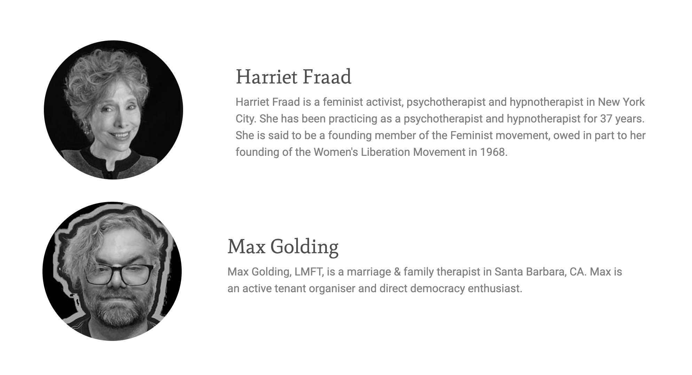
I've used the same heading font for their names to tie it to the podcasts title branding. I'd like to add more details to this in time but for now this is all the hosts supplied.
 
 

## Contact
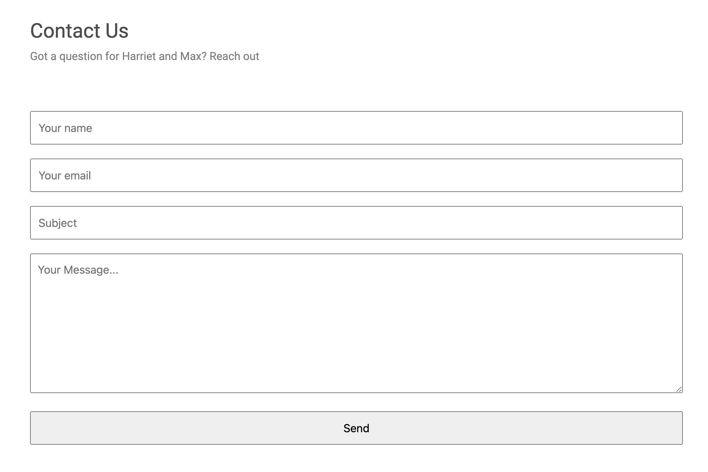
Fairly standard contact form lol. I didn't use the label tag but instead opted for placeholder text to do the job of communicating what each field was for.
 
 
## Footer
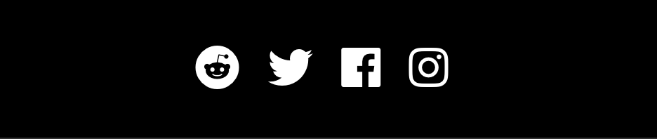
The footer is sticky and displays throughout, the social media presence of the podcast is important for generating new listners and potential supporters, hence it is in a prominent place.
 
 
 

# Testing User Stories from User Experience (UX) Section

## First Time Visitor Goals:

>I want to quickly understand the sites purpose and to listen/subscribe.

The header/hero sums up the site with easy access to listen. 

 

>I want to navigate the site, effortlessly, to find content.

The single page design allows quick/intuitive use of the site.

 

>I want to be assured that this is a trustworthy operation, I want access to others opinions/reviews and the social media feeds to see what others are saying.

The five star review (and the Apple podcast site which includes many reviews) and the social media links are all one tap/click away.

 

## Returning Visitor Goals:

>I've decided I want to support the podcast, so want that to be obvious how I do that.

The Patreon links are... everywhere!

 

>I want a quick way to get in contact with the hosts.

The social media and the link to the contact form are displayed at all times.

 

>I want to find social media links.

You're in luck! They never go away!

 

## Frequent User Goals:

>I want to search different topics/episodes I might not have listened to.

Currently the user can scroll the embedded playlist but there is room for major improvement here.

 

>I want to stay up-to-date about the podcast, website etc.

The social media links will do this but a newsletter might serve the user better.

 
 

# FUTURE EXPANSION

Rather than a playlist of all the episodes, I would like to embed each episode separately and then dynamically load them based on the users navigational behaviour. Why?

Because on Patreon each episode has an extensive written description and links to articles, organisations and guests social media. I’d like to include that information next to each embedded episode, with the user having the option to expand or contract to read.

Having this data on the site, coupled with a search and filter capability to quickly find relevant topics, will improve the value to the user. 

A free mailing list for events, website updates etc could also be of value to would-be patrons.
 
 
 

# TESTING

## Devices & Browsers

The site was tested on the following devices with no problems.

Device | OS | Browser
-------|----|---------
iPhone 8 | iOS 14 | Safari, Ghostery, Firefox 
Macbook Pro | Big Sur | Safari, Firefox, Chrome
Huawei P8 Lite | Android 6.0 | Firefox & Default Internet Browser
Samsung Galaxy Tab A | Android 6.0.1 | Firefox & Samsung Internet Browser

 

## Validator testing

HTML: No errors were returned in my code passing through the W3C validator, however [it did not like the official Spotify iframe embeds](assets/images/readme_images/html_spotify.png) but there isn't much I can do about that! 

CSS: No errors were found when passing through the Jigsaw W3C validator.
 
 

## Lighthouse results

Desktop [View](assets/images/readme_images/lh_desktop.png)

Mobile [View](assets/images/readme_images/lh_mobile.png)
 
 

## Known bugs

1. I'm aware that using the header tag would be good semantic use of HTML however, if the nav was inside the header, the nav would not stick to the top of the page. For this reason I commented out the header tag.

2. In the episodes section, the embedded spotify episode has some text beside it. Depsite a considerable amount of time trying to figure it out, I couldn't center-align the text without it breaking the 'p' and 'a' sections into five columns. So instead I used an inline display property and settled to have it left-aligned on mobile.
 
 
 

# DEPLOYMENT

The site was deployed to GitHub pages by doing the following:

* GitHub repository > Settings > Pages
* Source drop-down menu > Select Master Branch
* Click Save
* The live link can be found [here](https://liamthetate.github.io/itsnotjustinyourhead/) 

I also deployed the website to my own ftp/website [here](http://liamtate.co.uk/injiyh/index.html), to do this I did the following: 

* GitHub Repository > dropdown menu 'Code' 
* 'Download zip' > open zip > Filezilla to transfer files

 
 
 

# CREDITS

## Content: 
* The opening text description of the podcast on the home/hero page is taken from the  Patreon page.

* The social media icons in the footer and the Patreon logo in the red buttons are taken from Font Awesome.

* Code:
    - Anchor links so they don't crop off the content: [Source](https://stackoverflow.com/questions/10732690/offsetting-an-html-anchor-to-adjust-for-fixed-header)

            :target {
            display: block;
            position: relative;
            top: -100px;
            visibility: hidden;
            /*-- Taken from:  */
            }

    - Colour gradient on icon/logo: [Source](https://cssgradient.io/blog/css-gradient-text/) & [Source](https://learn.shayhowe.com/html-css/writing-your-best-code/)

            .navbar-light .icon-color {
            /*- Icon color with gradient -*/
            background: -webkit-linear-gradient(rgb(233, 105, 0), rgb(255, 217, 0));
            background: -moz-linear-gradient(rgb(233, 105, 0), rgb(255, 217, 0));
            background: -linear-gradient(rgb(233, 105, 0), rgb(255, 217, 0));

            -webkit-background-clip: text;
            -webkit-text-fill-color: transparent;

            -moz-background-clip: text;
            -moz-text-fill-color: transparent;

            Initial code from: 
            Further formatting inspired by 
            }

    -  Idea to contain site on large screens: [Source](https://forum.bootstrapstudio.io/t/how-to-center-a-website-content/3115/8)

            .container-fluid {
                max-width: 980px;
                padding-left: 0px;
                padding-right: 0px;
            }

    -  Code/idea for greyscaling photo: [Source](https://www.w3schools.com/howto/howto_css_image_bw.asp)
            
            .photo {
                -webkit-filter: grayscale(100%);
                filter: grayscale(100%);
                border-radius: 50%;
                height: 200px;
            }

    - Modal code from Bootstrap docs: [Source](https://getbootstrap.com/docs/4.0/components/modal/)
 
 
 
    
## Media: 
* The podcast poster image and the pictures in the about section where supplied by the hosts.

