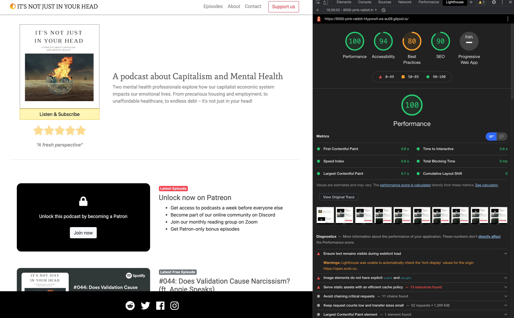
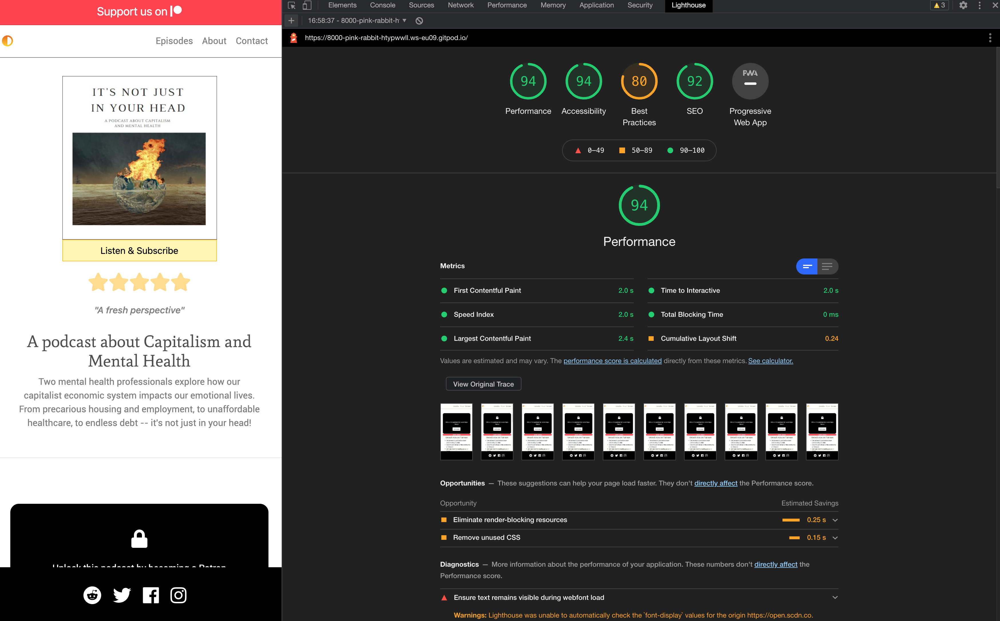
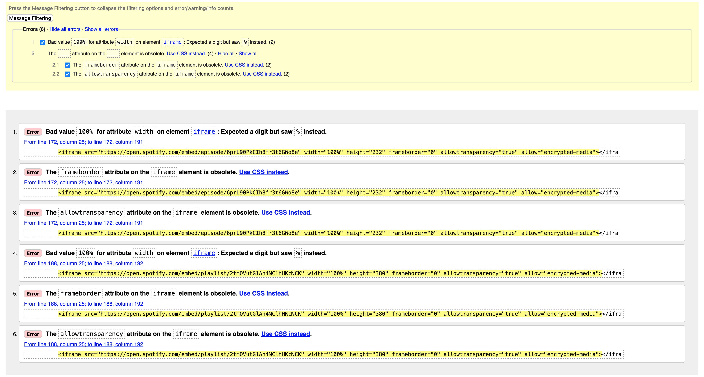

# IT'S NOT JUST IN YOUR HEAD

I am an audio editor and social media manager for a weekly [podcast](https://podcasts.apple.com/us/podcast/its-not-just-in-your-head/id1508932075) by two therapists (+ guests) about Mental Health and Capitalism. The podcast aims to raise awareness that mental health issues aren’t just a problem of the individual but symptomatic of systemic problems.

As one has no real choice but to live in (or under) Capitalism, the podcast also needs money to operate - lol - and whilst we have a [Patreon](https://www.patreon.com/itsnotjustinyourhead) page and visibility on all the major podcast platforms, this new website will function as another point of entry for potential supporters.

# PRODUCT SHOT

# UX

## User Stories

First Time Visitor Goals:
    
    * I want to quickly understand the sites purpose, listen/subscribe and learn about the hosts.

    * I want to navigate the site, effortlesslly, to find content.

    * I want to be assured that this is a trustworthy operation, I want access to others opinions/reviews and the social media feeds to see what others are saying.

Returning Visitor Goals:

    * I've decided I want to support the podcast, so want that to be obvious how I do that.

    * I want a quick way to get in contact with the hosts.

    * I want to find social media links.

Frequent User Goals:

    * I want to search different topics/episodes I might not have listened to.

    * I want to stay up-to-date about the podcast, website etc.

## Design

Colour Scheme
* The two main colours used are Code Insititue red, and white.

Typography
* The Montserrat font is the main font used throughout the whole website with Sans Serif as the fallback font in case for any reason the font isn't being imported into the site correctly. Montserrat is a clean font used frequently in programming, so it is both attractive and appropriate.

* Imagery
    * Imagery is important. The large, background hero image is designed to be striking and catch the user's attention. It also has a modern, energetic aesthetic.

* Wireframes
    * Home Page Wireframe - View
    * Mobile Wireframe - View
    * Contact Us Page Wireframe - View
    
    
    
    
# FRAMEWORKS, LIBARARIES & PROGRAMS USED

1. Bootstrap 4.5:
    * Bootstrap was used throughout for layout, buttons etc.
    
2. Hover.css:
    * Hover.css was used for the benefit of desktop users: a nice underline on mouse hover!
    
3. Google Fonts:
    * Google fonts was used for 'Mate SC', 'Mate' and 'Roboto' fonts throughout the website.
    
4. Font Awesome:
    * Font Awesome was for the top navigation icon and the social media links.
    
5. jQuery:
    * jQuery was used for the Modal window.
    
6. Git
    * Git was used for version control by utilizing the Gitpod terminal to commit to Git and Push to GitHub.
    
7. GitHub:
    * GitHub is used to store the projects code after being pushed from Git.
    
8. Photoshop:
    * Photoshop was used to crop, resize and export the 'about' photos for the website.
    
9. Balsamiq:
    * Balsamiq was used to create the wireframes during the design process.

10. Spotify:
    * Spotify was used for embedding episodes and a playlist into the site.
    
11. https://webformatter.com/:
    * To format my html and css
    

# FEATURES

Landing page:
Users can listen and subscribe for free.
Support button prominant.
(Play a trailer)

Episodes:
Another prompt, locked content.
Free content episode
Playlist of free episodes

About:
Put a face to the voices
Learn a small amount 

Contact:
listeners to reach out with questions etc

nav bar description and pic

(* Featured on all three pages, the full responsive navigation bar includes links to the Logo, Home page, Gallery and Sign Up page and is identical in each page to allow for easy navigation. * This section will allow the user to easily navigate from page to page across all devices without having to revert back to the previous page via the ‘back’ button.)

landing page and pic

(* The landing includes a photograph with text overlay to allow the user to see exactly which location this site would be applicable to. * This section introduces the user to Love Running with an eye catching animation to grab their attention)

Episode and pic

About and pic

Contact and pic

Footer and pic

# Testing User Stories from User Experience (UX) Section

## First Time Visitor Goals:
    
    * I want to quickly understand the sites purpose, listen/subscribe and learn about the hosts.

The header/hero sums up the site, with quick and easy access to listen. Information about the hosts is there.

    * I want to navigate the site, effortlesslly, to find content.

The single page design allows quick and easy use.

    * I want to be assured that this is a trustworthy operation, I want access to others opinions/reviews and the social media feeds to see what others are saying.

The header review, the links to apple podcast (and their reviews) and the social media links are all there within one our two clicks/taps.

## Returning Visitor Goals:

    * I've decided I want to support the podcast, so want that to be obvious how I do that.

The links are everywhere lol

    * I want a quick way to get in contact with the hosts.

Contact form

    * I want to find social media links.

Right there

## Frequent User Goals:

    * I want to search different topics/episodes I might not have listened to.

Currently the user can scroll the embedded playlist but there is room for expansion here.

    * I want to stay up-to-date about the podcast, website etc.

The social media links will do this but a newsletter might serve the user better.

# Future Expansion/Features 

On Patreon each episode has an extensive written description and links to articles, organisations and guests social media. I’d like to include that information next to each embedded episode, with the user having the option to expand or contract to read.

Having this data on the site, coupled with a search and filter capabilty for users to quickly find relevant topics, will improve the value to the user. The cross linking to other site will also improve the sites Search Engine ranking.

A free mailing list for events, website updates etc could also be of value to would-be patrons.

# TESTING

The site was tested (links, layout, display) on the following devices.

Device | OS | Browser
-------|----|---------
iPhone 8 | iOS14 | Safari, Ghostery, Firefox 
Macbook Pro | Big Sur | Safari, Firefox, Chrome
Huawei P8 Lite | Android 6.0 | Mozilla Firefox for Android
Samsung Galaxy Tab A | Android 6.0.1 | Firefox for Android

## LIGHTHOUSE RESULTS

Desktop: 
Mobile: 

A slight tweak to the font size or color contrast between background and text would elevate these scores slightly higher. 

## VALIDATOR TESTING

* HTML
    * No errors were returned in my code passing through the W3C validator, however it did not like the official Spotify iframe embeds, but there isn't much I can do about that!

* CSS
    * No errors were found when passing through the Jigsaw W3C validator

    
## UNFIXED BUGS

* I'm aware that using the header tag would be good semnatic use of html, however for some reason that I couldn't figure it out, if the nav was inside the header it would not stick to the top of the page. For this reason I commented out the header tag.

* In the episodes section, the free embedded spotify episode has some text beside it. I couldn't center align the text without it breaking the 'p' and 'a' section into five columns. So instead I used an inline display property and settled to have it left aligned on mobile.
    

# DEPLOYMENT

* The site was deployed to GitHub pages. The steps to deploy are as follows:
    * In the GitHub repository, navigate to the Settings tab
    * From the source section drop-down menu, select the Master Branch
    * Once the master branch has been selected, the page will be automatically refreshed with a detailed ribbon display to indicate the successful deployment.
The live link can be found here - https://code-institute-org.github.io/love-running-2.0/index.html

GitHub Pages
The project was deployed to GitHub Pages using the following steps...
1. Log in to GitHub and locate the GitHub Repository
2. At the top of the Repository (not top of page), locate the "Settings" Button on the menu.
    * Alternatively Click Here for a GIF demonstrating the process starting from Step 2.
3. Scroll down the Settings page until you locate the "GitHub Pages" Section.
4. Under "Source", click the dropdown called "None" and select "Master Branch".
5. The page will automatically refresh.
6. Scroll back down through the page to locate the now published site link in the "GitHub Pages" section.

Forking the GitHub Repository
By forking the GitHub Repository we make a copy of the original repository on our GitHub account to view and/or make changes without affecting the original repository by using the following steps...
1. Log in to GitHub and locate the GitHub Repository
2. At the top of the Repository (not top of page) just above the "Settings" Button on the menu, locate the "Fork" Button.
3. You should now have a copy of the original repository in your GitHub account.

Making a Local Clone
1. Log in to GitHub and locate the GitHub Repository
2. Under the repository name, click "Clone or download".
3. To clone the repository using HTTPS, under "Clone with HTTPS", copy the link.
4. Open Git Bash
5. Change the current working directory to the location where you want the cloned directory to be made.
6. Type git clone, and then paste the URL you copied in Step 3.
$ git clone https://github.com/YOUR-USERNAME/YOUR-REPOSITORY
7. Press Enter. Your local clone will be created.
$ git clone https://github.com/YOUR-USERNAME/YOUR-REPOSITORY
> Cloning into `CI-Clone`...
> remote: Counting objects: 10, done.
> remote: Compressing objects: 100% (8/8), done.
> remove: Total 10 (delta 1), reused 10 (delta 1)
> Unpacking objects: 100% (10/10), done.
Click Here to retrieve pictures for some of the buttons and more detailed explanations of the above process.

# CREDITS

    ## Content: 
    * The text for the Home page was taken from Patreon 
    * The icons in the footer were taken from Font Awesome
    
    ## Media: 
    * The images used for the gallery page were taken from this other open source site

